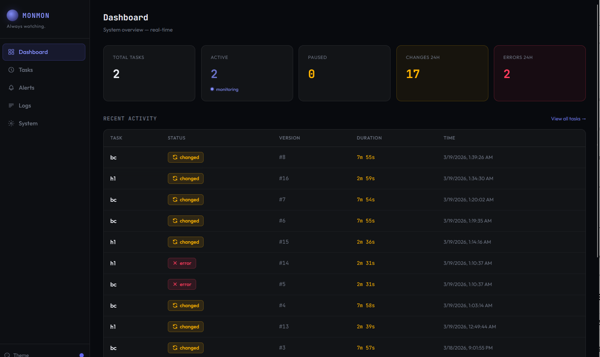
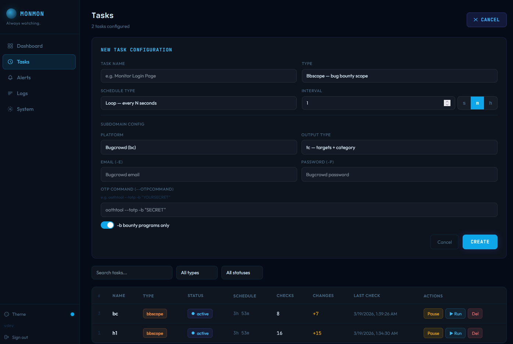
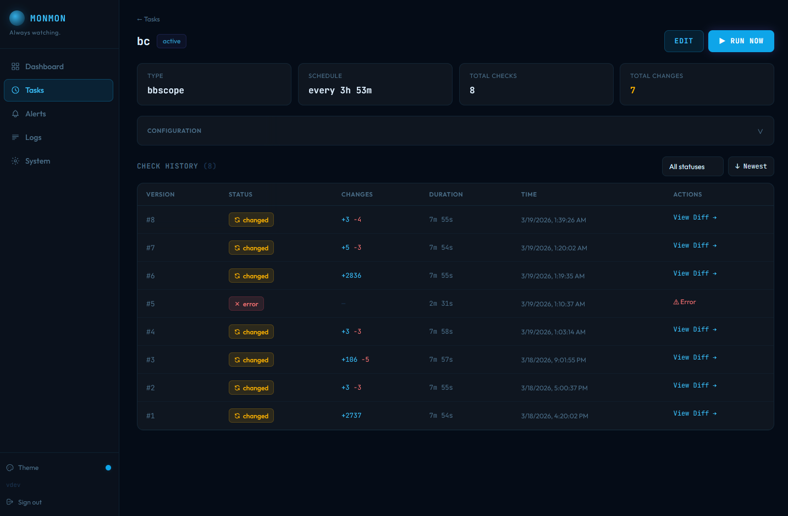
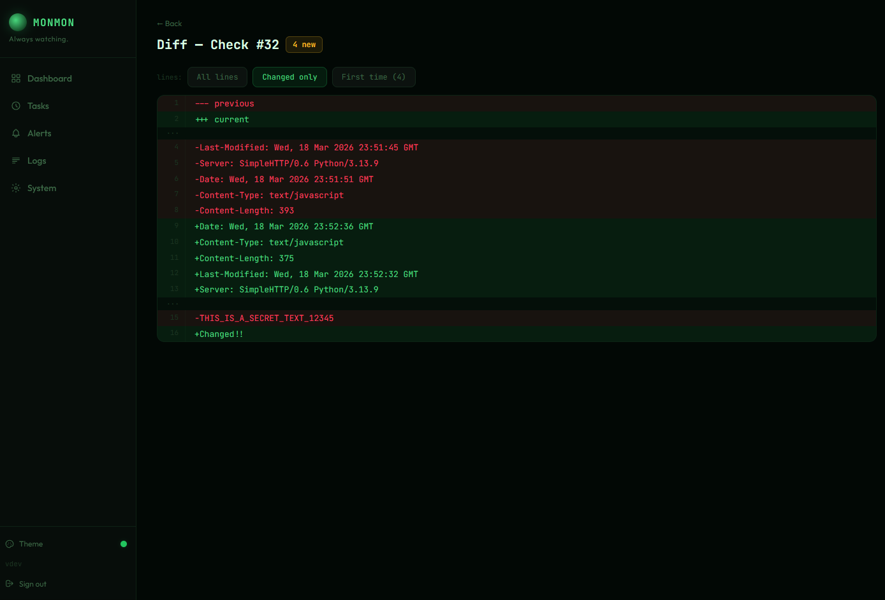
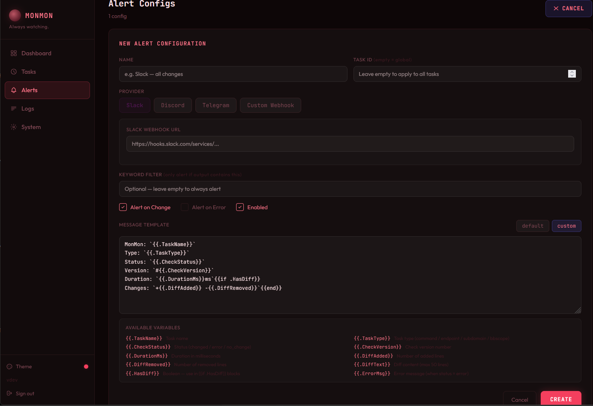
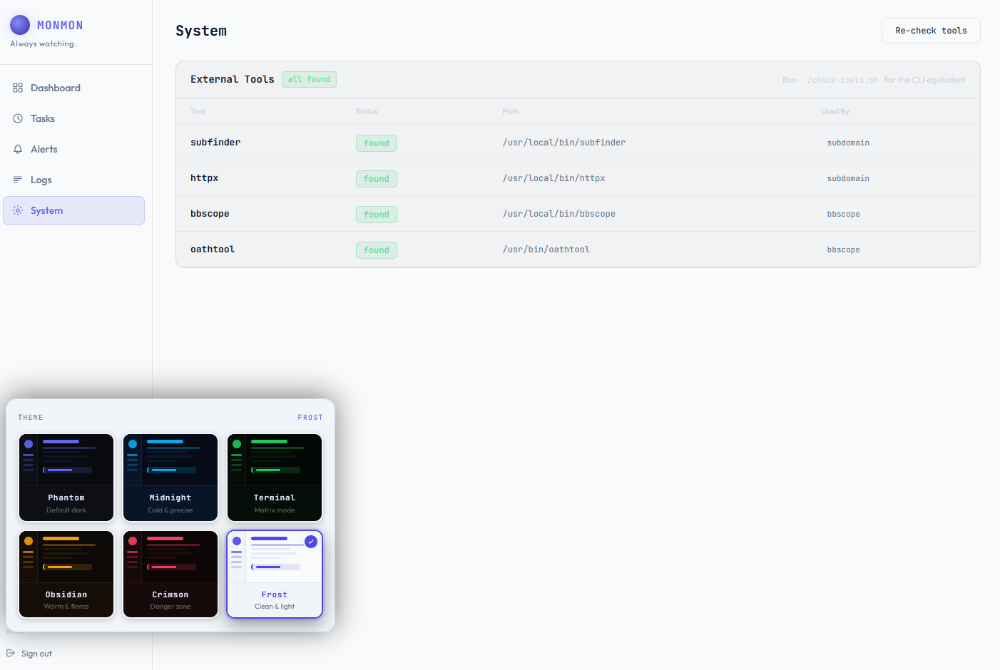

<p align="center">
<pre align="">
   __  __             __  __
  |  \/  | ___  _ __ |  \/  | ___  _ __
  | |\/| |/ _ \| '_ \| |\/| |/ _ \| '_ \
  | |  | | (_) | | | | |  | | (_) | | | |
  |_|  |_|\___/|_| |_|_|  |_|\___/|_| |_|
   
  Monster Monitoring by 0xNayel
</pre>
</p>

<h3 align="center">
Monster Monitoring

Changes monitoring for bug bounty hunters</h3>

<p align="center">
  <a href="https://github.com/0xNayel/MonMon/blob/main/LICENSE"></a>
  <a href="https://golang.org/"></a>
  <a href="https://github.com/0xNayel/MonMon/stargazers"></a>
  <a href="https://hub.docker.com/r/nayelxx/monmon"></a>
</p>

<p align="center">
  <a href="#installation">Install</a> &bull;
  <a href="#features">Features</a> &bull;
  <a href="#task-types">Tasks</a> &bull;
  <a href="#alerts">Alerts</a> &bull;
  <a href="#cli">CLI</a> &bull;
  <a href="docs/API.md">API</a>
</p>

---

MonMon runs your recon on autopilot. Point it at targets, set intervals, and get alerted the second anything changes — new subdomain, scope expansion, endpoint diff, command output shift. Everything is diffed, versioned, and delivered to Telegram, Slack, or Discord before anyone else notices.

Single binary. Embedded dashboard. Zero external dependencies.

---

## Screenshots

<!-- Dashboard — Phantom theme -->
<p align="center">
  
  <br/><sub>Dashboard — real-time stats (active tasks, changes, errors) and recent activity feed</sub>
</p>

<!-- Tasks — task creation form + task list -->
<p align="center">
  
  <br/><sub>Tasks — create and manage monitoring jobs with bbscope, endpoint, subdomain, and command types</sub>
</p>

<!-- Task Detail — check history with edit + run -->
<p align="center">
  
  <br/><sub>Task Detail — full check history with version tracking, diff links, inline edit, and manual run</sub>
</p>

<!-- Diff Viewer — Terminal theme -->
<p align="center">
  
  <br/><sub>Diff Viewer — unified diffs with line numbers, added/removed highlighting, and change filters</sub>
</p>

<!-- Alerts — Crimson theme -->
<p align="center">
  
  <br/><sub>Alerts — multi-provider (Slack, Discord, Telegram, Webhook), custom Go templates, keyword filters</sub>
</p>

<!-- System + Theme Picker — Frost theme -->
<p align="center">
  
  <br/><sub>System & Themes — external tool status check + 6 built-in themes with live preview</sub>
</p>

---

## Features

| Category | Details |
|----------|---------|
| **Monitoring Modes** | `command` · `endpoint` · `subdomain` · `bbscope` — four task types covering shell output, HTTP responses, subdomain discovery, and bug bounty scope |
| **Smart Diff Engine** | Unified diffs with per-URL breakdown for bulk endpoints. Filters: All / Changed / First-time. Every new line is checked against full task history, not just the previous run |
| **Subdomain Pipeline** | `subfinder -all` → `httpx` per domain, threaded execution, stable keyed output — reordering never creates false positives |
| **Scope Monitoring** | HackerOne, Bugcrowd, Intigriti, YesWeHack via `bbscope`. Diff scope expansions instantly |
| **Bulk Endpoints** | Monitor multiple URLs in a single task. Each URL gets its own diff section. Modes: `body` · `full` · `metadata` · `regex` |
| **Alerts** | Slack, Discord, Telegram, custom webhook. Per-task or global scope. Keyword filter. Custom message templates. Test button per config |
| **Dashboard** | React SPA embedded in the binary. Task manager, diff viewer with collapse + search, real-time log stream (WebSocket), animated stats |
| **Multi-Theme UI** | 6 themes (Phantom, Midnight, Terminal, Obsidian, Crimson, Frost) with live preview, View Transitions API, and localStorage persistence |
| **Self-Update** | `monmon update` checks GitHub releases and self-updates the binary |
| **Single Binary** | SQLite (WAL), embedded frontend, JWT auth, auto-generated secret. No external services |

---

## Installation

### Docker Hub (recommended)

Pre-built image with all tools (`subfinder`, `httpx`, `bbscope`, `oathtool`) included.

```bash
git clone https://github.com/0xNayel/MonMon.git && cd MonMon

# Set admin credentials
echo "MONMON_ADMIN_USER=admin" >> .env
echo "MONMON_ADMIN_PASSWORD=changeme" >> .env

docker compose up -d
```

Open **http://localhost:8888**

#### Updating (Docker)

```bash
docker compose pull && docker compose up -d
```

#### Build from source (Docker)

Edit `docker-compose.yml`: comment out the `image:` line and uncomment `build: .`, then:

```bash
docker compose build --no-cache && docker compose up -d
```

---

### go install

```bash
go install github.com/0xNayel/MonMon/cmd/monmon@latest
monmon server
```

Open **http://localhost:8888** — requires Go 1.22+.

#### Updating (go install)

```bash
monmon update
```

---

### Build from source

```bash
git clone https://github.com/0xNayel/MonMon.git && cd MonMon
make build
./monmon server
```

---

## Prerequisites

Required **only** for `subdomain` and `bbscope` task types. Not needed for `command` / `endpoint` tasks, or when using Docker.

```bash
# subfinder
go install -v github.com/projectdiscovery/subfinder/v2/cmd/subfinder@latest

# httpx
go install -v github.com/projectdiscovery/httpx/cmd/httpx@latest

# bbscope
go install github.com/sw33tLie/bbscope@latest

# oathtool (for bbscope OTP) — install via package manager
# Debian/Ubuntu: apt install oathtool
# macOS: brew install oath-toolkit
# Alpine: apk add oath-toolkit-oathtool
```

> Verify tools: open **System** in the dashboard, or check the API at `/api/system/tools`.

---

## Task Types

### `command` — run any shell command, diff the output

```json
{
  "command": "gau target.com | sort -u",
  "output_mode": "stdout",
  "timeout_sec": 120
}
```

Pipe anything — `nuclei`, `ffuf`, `gau`, `waybackurls`, `katana`, custom scripts. MonMon diffs the stdout.

---

### `endpoint` — poll HTTP endpoints, diff the response

```json
{
  "urls": ["https://target.com/api/v1/", "https://target.com/api/v2/"],
  "method": "GET",
  "monitor_mode": "body"
}
```

Monitor modes: `body` · `full` (headers + body) · `metadata` (status / length / title) · `regex`

Multiple URLs per task — each gets its own diff section.

---

### `subdomain` — continuous subdomain discovery

```json
{
  "domains": ["target.com", "sub.target.com"],
  "httpx_sc": true,
  "httpx_title": true,
  "httpx_td": true,
  "threads": 5
}
```

`subfinder -all` per domain → `httpx`. Stable keyed output means reordering never creates false diffs.

---

### `bbscope` — bug bounty scope monitoring

```json
{
  "platform": "h1",
  "token": "your_api_token",
  "username": "your_h1_username",
  "bounty_only": false,
  "output_type": "tc"
}
```

Platforms: `h1` (HackerOne) · `bc` (Bugcrowd) · `it` (Intigriti) · `ywh` (YesWeHack). Get alerted the moment a scope expansion drops.

| Platform | Auth | Extra flags |
|----------|------|-------------|
| `h1` | `-t` token, `-u` username | |
| `bc` | `-E` email, `-P` password | `--otpcommand` for OTP |
| `it` | `-t` API token | `-c` categories (url, cidr, mobile, etc.) |
| `ywh` | `-t` token or `-E`/`-P` email+password | `-O` OTP command, `-c` categories |

---

## Alerts

Configured entirely from the dashboard UI.

1. **Alerts** → **+ NEW ALERT**
2. Name it, pick a provider (Slack / Discord / Telegram / Webhook)
3. Set scope: global or per-task
4. Trigger: on change, on error, or both
5. Optional keyword filter
6. Optional custom message template with variables:

| Variable | Description |
|----------|-------------|
| `{{.TaskName}}` | Task name |
| `{{.TaskType}}` | Task type |
| `{{.CheckStatus}}` | Check result status |
| `{{.CheckVersion}}` | Check version number |
| `{{.DurationMs}}` | Execution time in ms |
| `{{.DiffAdded}}` | Lines added |
| `{{.DiffRemoved}}` | Lines removed |
| `{{.ErrorMsg}}` | Error message (if any) |

---

## Configuration

Settings via YAML or environment variables with `MONMON_` prefix.

```yaml
server:
  port: 8888

database:
  path: "./data/monmon.db"

auth:
  jwt_secret: ""            # auto-generated if empty

logging:
  level: "info"             # debug / info / warn / error
  file: "./data/monmon.log"

retention:
  default_keep: 0           # 0 = keep all, N = keep last N checks
  cleanup_interval: "1h"

tools:
  subfinder: "subfinder"
  httpx: "httpx"
```

Environment override example: `MONMON_SERVER_PORT=9090`

---

## CLI

```bash
monmon server                              # Start server (default :8888)
monmon server -p 9090 -c config.yaml       # Custom port + config
monmon version                             # Print version
monmon update                              # Self-update from GitHub

monmon task list                           # List all tasks
monmon task add-cmd "gau target.com"       # Add command task
monmon task add-url "https://target.com"   # Add endpoint task
monmon task add-domain target.com          # Add subdomain task
monmon task run <id>                       # Trigger immediate check
monmon task pause <id>                     # Pause task
monmon task resume <id>                    # Resume task
monmon task delete <id>                    # Delete task + checks

monmon check list <task_id>                # List checks for a task
monmon check diff <check_id>               # Show diff output

monmon logs                                # View recent logs
```

---

## Running in Background

**Docker** (recommended):
```bash
docker compose up -d
```

**Screen / tmux**:
```bash
screen -dmS monmon monmon server
# or
tmux new -d -s monmon 'monmon server'
```

**nohup**:
```bash
nohup monmon server > /dev/null 2>&1 &
```

---

## Documentation

Full API reference available in **[docs/API.md](docs/API.md)**. Architecture details in **[ARCHITECTURE.md](ARCHITECTURE.md)**.

---

## License

[MIT](LICENSE)
